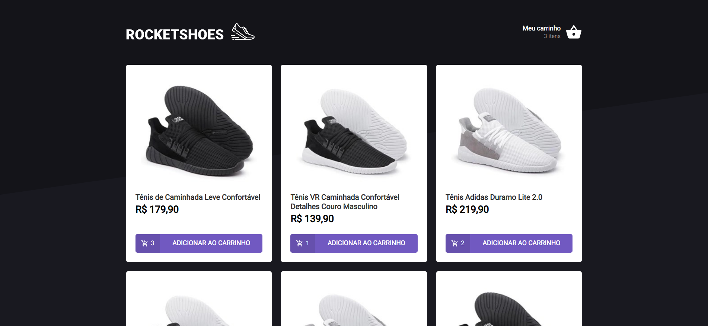
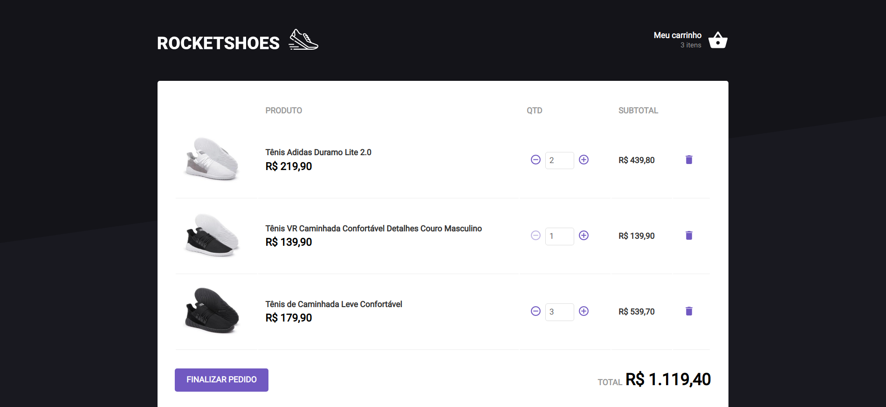

<h1 align="center">Rocketshoes</h1>

 
 

## Desafio feito durante a trilha do Ignite de ReactJS da Rocketseat.

 
 

## Os objetivos do desafio eram solucionar os códigos ausentes e completar aplicação, usando hooks e typescript.

 
 

<h1 align="center">Problemas solucionados</h1>

- Consultar API Fake com JSON Server. (produtos e estoque de produtos)
- Adicionar e remover produtos do carrinho.
- Usar a função de reduce para somar o preço dos produtos do carrinho e seu montante no resultado final.

<h2 align="center">Imagens do projeto</h2>

<h1 align="center">
    
</h1>

<h1 align="center">
    
</h1>
